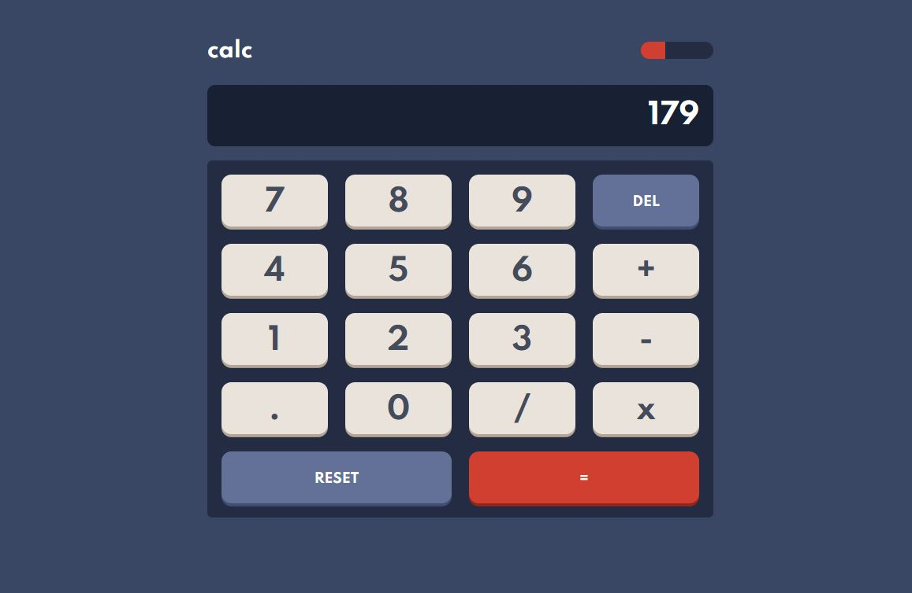
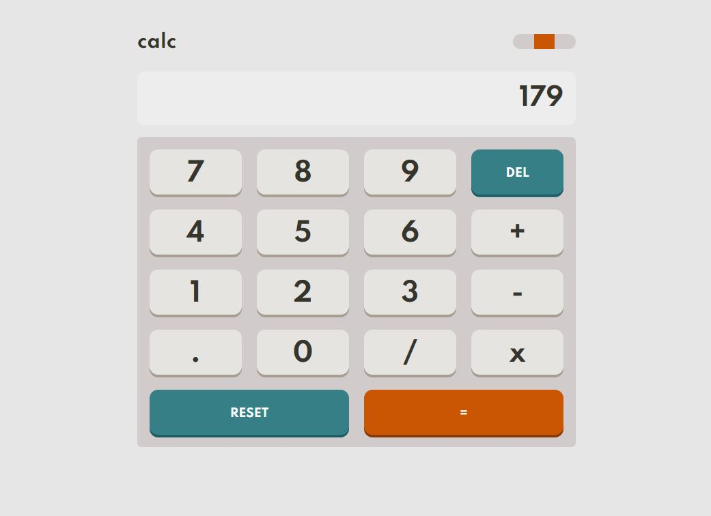
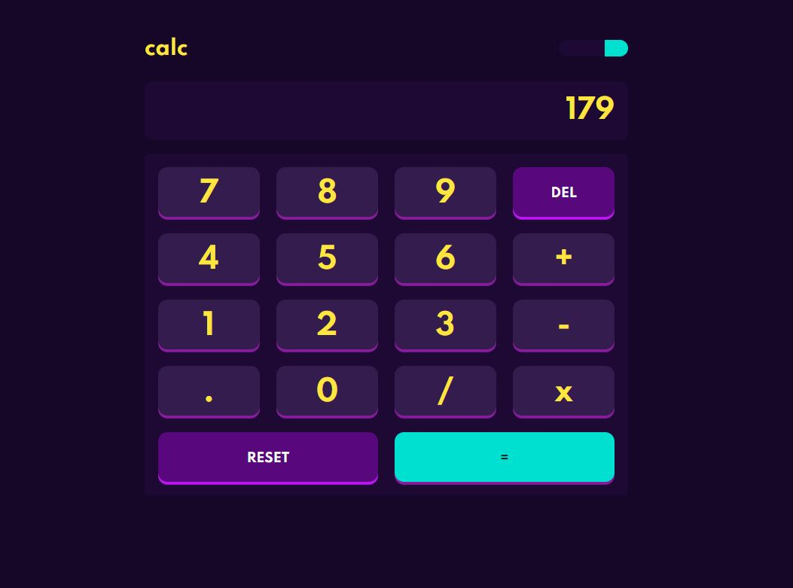

# Frontend Mentor - Calculator app solution

This is a solution to the [Calculator app challenge on Frontend Mentor](https://www.frontendmentor.io/challenges/calculator-app-9lteq5N29). Frontend Mentor challenges help you improve your coding skills by building realistic projects.

## Table of contents

- [Overview](#overview)
  - [The challenge](#the-challenge)
  - [Screenshot](#screenshot)
  - [Links](#links)
- [My process](#my-process)
  - [Built with](#built-with)
  - [Continued development](#continued-development)
  - [Useful resources](#useful-resources)
- [Author](#author)

## Overview

### The challenge

Users should be able to:

- See the size of the elements adjust based on their device's screen size
- Perform mathematical operations like addition, subtraction, multiplication, and division
- Adjust the color theme based on their preference

### Screenshot

### Links

- Live Site URL: [Calculator Site](https://foolhardy21.github.io/calculator-app/)

## My process

### Built with

- Semantic HTML5 markup
- CSS custom properties
- Flexbox
- CSS Grid
- JS Script
- DOM Elements

### Continued development

I wish to improve this project by adding a functionality of solving multiple calculations using BODMAS and improving the edge cases.

### Useful resources

- [Calculator in JavaScript](https://www.youtube.com/watch?v=j59qQ7YWLxw) - This resource helped me by giving information about accessing DOM elements in script.

## Author

- Frontend Mentor - [@foolhardy21](https://www.frontendmentor.io/profile/foolhardy21)
